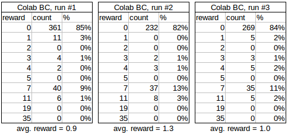

# MineRL2021-Research-baselines
[MineRL 2021](https://minerl.io/) Research track baseline agent uses Behavioural cloning (BC).  

The agent can be run in three different ways:
1. Colab notebook
2. Standalone file
3. Submittable repository (Under construction)

## Colab notebook
This is the same code as in the standalone file, but with extra documentation and fully running in Colab:  
(the only difference is that the DATA_SAMPLES parameter is lower to fit the Colab RAM limits)

[MineRL Research track BC](https://colab.research.google.com/drive/1qU5sEnJPZj7q2KgRDwZ868jlBGerSsK7?usp=sharing)

## Standalone files
These are used to run the agent on your local machine and are located in the [standalone](https://github.com/KarolisRam/MineRL2021-Research-baselines/tree/main/standalone) directory.  
MineRL requires [JDK8](https://www.minerl.io/docs/tutorials/index.html) to be installed first.
After that, run:  
```
pip install --upgrade minerl
pip install pytorch
pip install stable_baselines3
```
The agent can be run with:  
```
python Behavioural_cloning.py
```
The BC agent comes with pretrained models. If you want to train it yourself, you will have to uncomment the `train()` line at the end of the file.

## Submittable repository
Under construction.

## Results
Baseline results over several hundreds of episodes can be seen below:  

  

Results above are achieved using the provided trained models. Colab baselines retrain every time and use a lower DATA_SAMPLES parameter (400,000 instead of 1,000,000) to fit the available RAM. Here are the results from three separate fully retrained models using those parameters:  

  

## Credits
Thank you to [Anssi Kanervisto](https://github.com/Miffyli) for developing most of the Behavioural cloning baseline.
